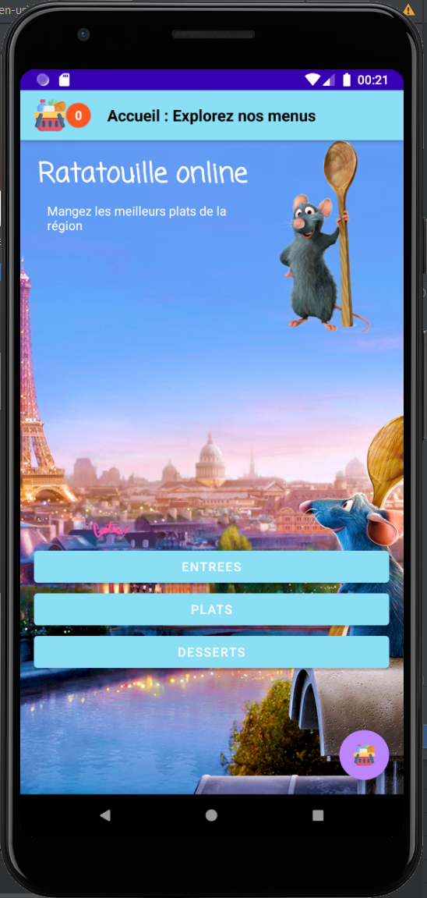

# AndroidERestaurant
Devoir Android - Ratatouille - Thibaud SIMON
Pour le cours de développement sous Android Studio

### En ce moment :
Partie IV- g/
+ successful singleton Basket handling thanks to Koin injector

## Previews
### Menu / Home page

### Dishes in the Main course category

### Dishes in the desserts category

### Details page

### Shopping Basket

